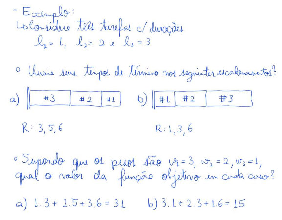
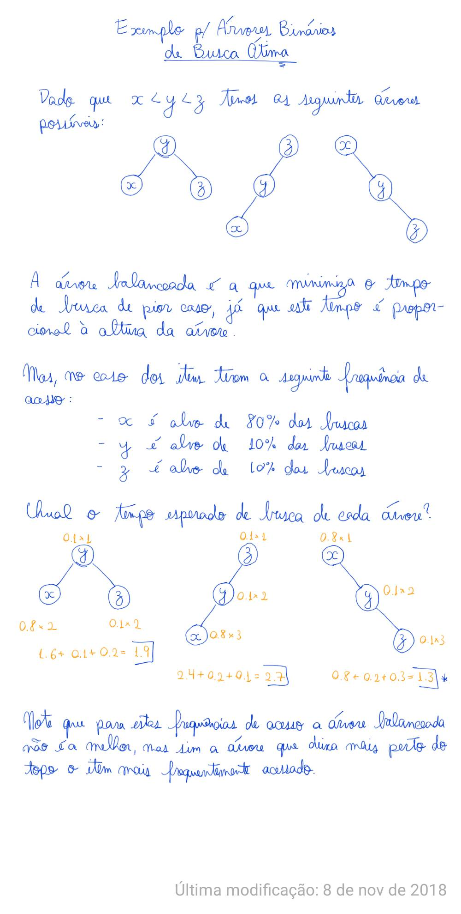

- [Algoritmos Gulosos](#algoritmos-gulosos)
- [Problema de Escalonamento](#problema-de-escalonamento)
- [Árvores Geradora Mínima](#arvores-geradora-minima)
- [Problema da Seleção de Atividades](#problema-da-selecao-de-atividades)
- [Problema da Mochila Fracionária](#problema-da-mochila-fracionaria)
- [Conjunto Independente de Peso Máximo em Grafos Caminhos](#conjunto-independente-de-peso-maximo-em-grafos)
- [Problema da Mochila - Prog Dinâmica](#problema-da-mochila---prog-dinamica)
- [Problema do Alinhamento de Sequências](#problema-do-alinhamento-de-sequencias)
- [Arvore Binaria de Busca Otima](#arvore-binaria-de-busca-otima)
- [Problema dos Caminhos Minimos - Prog Dinamica](#problema-dos-caminhos-minimos---prog-dinamica)
- [O problema dos caminhos minimos de todos para todos](#o-problema-dos-caminhos-minimos-de-todos-para-todos)
- [Cobertura por vertices](#cobertura-por-vertices)
- [Problema do Caixeiro Viajante - TSP](#problema-do-caixeiro-viajante---tsp)
- [Busca Local](#busca-local)

# Algoritmos Gulosos

Algorítmos que iterativamente realizam decisões míopes, isto é, a melhor possível para <br>
aquele momento.

- Geralmente é fácil projetar algorítmos gulosos para um problema
- Também costuma ser fácil analisar o tempo de execução
- Mas não é fácil projetar um algorítmo guloso correto
- Tampouco não é fácil provar a corretude
  - Geralmento por indução
  - Argumento de trocas entre soluções (??)

**Roteiro:**
- Compreender o problema
- Propor uma estratégia gulosa
- Resolver exemplos usando essa estragégia
- Escrever o pseudo-código do algoritmo
- Analisar a eficiência do algorítmo
- Provar a corretude da estratégia gulosa

# Problema de Escalonamento

- Temos 1 única máquina
- Diversas tarefas para realizar
  - Cada tarefa **j** tem um peso **wj > 0** e uma duração **lj > 0**
  - Peso é prioridade
- Uma solução é uma ordem (permutação) das tarefas
- **Objetivo:** Encontrar um solução que minimize a soma ponderada dos tempos de término.
  - ``min { sum_j[wj cj] }``
  - sendo **cj** o tempo em que **j** é concluído
  - Note que **cj** é igual ao tempo de execução **li** de toda <br>
  tarefa **i** que vem antes de **j** mais o própio **lj**



- **Algorítmo:** ordenar as tarefas em ordem decrescente pela razão: ``wi/li``

# Arvores Geradora Minima

- **Entrada:** G=(V,E,c)
- **Solução:** Uma árvore geradora T de custo mínimo

### Propriedade do corte:
- Dado um Grafo G=(V,E,c), considere uma aresta **e in E**. <br>
Suponha que existe um corte (A,B) tal que **e** é a aresta mais barata de G que cruza <br>
este corte.
  - Um corte (A,B) é uma partição dos vértices do grafo
  - Cruzar o corte significa que cada extremo da aresta está em uma das partes do corte
- Então **e** está na árovore geradora mínima de G.
  - Podemos falar da árvore geradora mínima porque supomos que não existem arestas com <br>
  menor custo.

### Algorítmo de Prim
- Propriedade do corte nos dá um critério para escolhas míopes que levam ao ótimo <br>
no caso do problema da árvore geradora mínima
  - Dado um grafo G=(V,E), considere uma aresta **e in E**. Suponha que existe um corte <br>
  (A,B) tal que **e** é a aresta mais barata de G que cruza este corte. Então **e** está <br>
  na árvore geradora mínima de G

**Pseudocódigo**

```python
Prim(G(V,E,c)):
  X = {s}
  T = []
  while X != V:
    e = (u,v) # a aresta de menor custo c(e) com u in X e v !in X
    T.add(e)
    X.add(e)
  return T
```
Há uma implementação mais eficiente usando heap

```python
PrimComHeap(G(V,E,c)):
  X = []
  T = []
  for v in V:
    d[v] = INF
    aresta[v] = null
  
  # escolha qualquer vértice inicial s
  d[s] = 0
  heap = MinHeap(V,d)
  
  while(heap.isNotEmpty()):
    v = heap.min()
    X.add(v)
    T.add(aresta[v])
    for e = (v,w) in E:
      if(c(v,w) < d[w]
      aresta[w] = (v,w)
      heap.update()

  return T
```

Análise de eficiência
- inicialização leva tempo O(n)
- o laço principal é executado O(n) vezes, já que em cada iteração um vértice é <br> 
removido do heap
  - cada operação de remoção do heap custa O(log n)
  - Assim, essas operações custam no total O(n log n)
- cada aresta do grafo pode desencadear uma operação de atualização de chave no heap
  - cada uma dessas operações custa O(log n)
   - como são m arestas, no total essas operações custam O(m log n)
- Portanto, a complexidade de tempo do algoritmo é O(m log n)
  - quase linear no tamanho do grafo

### Algorítmo de Kruskal
**Pseudocódigo**: 
eficiência O(n\*m)
```python
Kruskal(G(V,E,c):
  E.orderEdges() # ordene as arestas em ordem crescente de custo
  T = []
  for e in E: # E já está ordenado
    if T.union(e).isNotACycle():
      T.add(e)
  return T
```
**Algoritmo de Kruskal com Union-Find**
eficiência O(m log n)
```python
KruskalUnionFind(G(V,E,c):
  for v in V:
    makeset(v)
  
  E.orderEdges()

  T = []

  for e in E: # E já está ordenado
    if find(u) != find(v):
      T.add(e)
      union(u,v)

  return T
```

# Problema da Selecao de Atividades
- Conjunto S = {a1,a3,...,an} de atividades
- Cada atividade ai tem tempo de início si e de término ti com 0\<=si\<ti\<infinito
- A ideia é que as atividades precisam de um mesmo recurso e temos que decidir quais <br>
atividades serão escolhidas
- Assim, o objetivo é encontrar um subconjunto de cardinalidade máxima de atividades <br>
tal que nenhum par de atividades interfiram com outro
  - Duas atividades interferem se:
    - si\<=sj\<ti ou sj\<=siz\<tj

**Estratégia gulosa:** Pegar o que termina mais cedo
  - A ideia é que este critério deixa o máximo de tempo livre para alocar as demais tarefas

**Pseudocódigo:**
```python
selecionaAtividades(S):
  S.order() # ordenar atividades em S em ordem crescente de término
            # renomear atividades de 1 a n para facilitar
  t = 0
  A = []
  for i=1 to n:
    if si >= t:
      A.union(ai)
      t = ti
  return ai
```

**Eficiência:** theta(n log n)

# Problema da mochila fracionaria
- Um conjunto de itens S
  - Cada item i in S tem peso pi>0 e valor vi > 0
- Uma capacidade c (numero natural)

**Solução:** Uma coleção de frações de itens cujo peso total não ultrapassa c e cujo <br>
valor total seja máximo.

De modo compacto:

`` max(sum(i in S){ vi xi } )`` desde que ``sum(i in S){ pi xi } <= c``

**Estrtégia gulosa:**
- Se todosj os itens tivessem o mesmo peso, os mais valiosos teriam prioridade, pois <br>
acrescentam maior valor quando escolhidos
- Se todos so itens tivessem o mesmo valor, os mais leves teriam prioridade, pois ocupam <br>
menos capacidade quando escolhidos
- Assim, a função f(i) = vi/pi dá prioridade de cada item e um algoritmo guloso pode <br>
escoher a máxima fração de cada item seguindo a ordem decrescente desta função

**Pseudocódigo:**
```python
mochilaFracionaria(S,p,v,c):
  S.order() #ordenar os itens em ordem decrescente de vi/pi
            #renomear itens de 1 a n para facilitar
  c'=ci
  for i=1 to n:
    if pi <= c':
      xi = 1
      c' = c'-pi
    else:
      xi = c'/pi
      c'=0
  return x
```

# Conjunto Independente de Peso Maximo em Grafos Caminhos
- Introdução a **Programação Dinâmica**

**Entrada**: grafo caminho G=(V,E,w), w>=0
- Um grafo caminho é um grafo conexo sem bifurcações, ou sej,a o grau de todos os vértices<br> tem grau 2, excento os extremos, que tem grau 1

**Saída**: Conjunto idependente de peso máximo
- Um conjunto é independente se nenhum par de vértices é adjacente, i.e., tem uma aresta <br>
em comum.

**Exemplo**: Caminho quatro vértices e pesos 1,4,5,4

**Abordagem por força bruta:**

 - Vamos enumerar todos os 2^n diferentes subconjuntos
 
 - Descartar todos os que tem dois vértices adjacentes
 
 - Encontrar o de peso máximo dentre os que sobraram
 
 - **Vantagem:** Esta abordagem encontra o resultado correto
 
 - **Desvantagem:** Ela leva tempo Theta(2^n)

**Abordagem gulosa:**

 - Dentre várias possíveis, uma ideia é escolher sempre o vértice de maior peso para fazer parte da solução
 
 - Contra-exemplo: escolhendo o vértice de peso 5 do nosso exemplo anterior (1, 4, 5, 4), ficamos impossibilitados de escolher seus vizinhos.
 
 - Com isso, nossa solução terá peso 5+1 = 6
 
 - Por outro lado o ótimo teria peso 4+4 = 8


**Abordagem por Divisão e Conquista:**

 - Dividir o caminho ao meio parece uma boa ideia (semelhante a dividir um vetor ao meio)
 
 - Então podemos resolver recursivamente cada subproblema.
 
 - Contra-exemplo: no entanto, como mostra nosso exemplo anterior (1, 4, 5, 4), a solução ótima do primeiro subcaminho (1, 4) é 4 e a do segundo subcaminho (4, 5) é 5. Observe que não parece fácil combinar essas soluções, já que o primeiro 4 e o 5 são adjacentes.

**Usando Programação Dinâmica:**

A parte central do projeto de algoritmos utilizando **programação dinâmica** é encontrar a<br> **subestrutura ótima** da solução do problema.
- Isso significa descrever um soluao ótima em função de soluções ótimas para subproblemas menores
- A princípio, usso serve para reduzir o espaço de uma busca exaustiva, mas o impactio pode ser muito maior no tempo de execução, como veremos depois.

No caso do problema do Conjunto Independente de Peso Máximo em Grafos Caminhos, consideramos:
- uma solução ótima S
- v[n] o último vértice do grafo caminho G

Analisando por casos:
1. v[n] não está em S:
    - Sendo G' = G sem vn, temos que S é uma solução ótima em G'
2. v[n] está em S:
    - neste caso v[n-1] não pode estar em S
    - Seja G" = G sem v[n] e v[n-1]
    - Seja S" = S \ {v[n]}
    - Temos que S" é um solução ótima en G"

Identificando a subsestrutura ótima da solução conseguimos descrever a solução ótima da <br>
seguinta forma:

- Uma solução ótima para G deve ser a melhor entre:
  - Uma solução ótima em G' (G sem o último vértice)
  - v[n] + uma solução ótima em G" (G sem o os dois últimos vértices)

Não sabemos qual dos dois casos se aplica, mas isso nos sugere o seguinte algoritmo recursivo

```python
conjuntoIndependente(G=(V,E,w)):
  if |V| = 1: # Caso base
    return v1

  S' = conjuntoIndependente(G')
  S" = conjuntoindependente(G")

  return max(w(S"), w(S") + w(v[n))
```

Embora nosso algoritmo encontre o valor da solução ótima, ele não obtém a solução em si.
- vamos percorrer o vetor do fim para o início
- em cada posição verificamos qual foi a escolha que o algoritmo fez (usando a recorrência)
  - adicionamos o vértice à solução (se for o caso)
  - e avançamos no vetor (em direção ao início)

- Para ficar mais claro, considere o seguinte pseudocódigo
  - supondo que o vetor A foi preenchido pelo algoritmo ``conjuntoIndependente()``

```python
recSol(G,A) :
  S = []
  i = n
  while i>= 1:
    if A[i-1] >- A[i-2] + w[v[i]]
      i = i -1
    else
      S.add(v[i])
      i = i - 2

  return S
```
# Problema da Mochila - Prog Dinamica
**Entrada:** n itens, sendo que cada item i (1<=i<=n) tem
- valor v[i] > 0
  - peso w[i] > 0 e inteiro
- capacidade W > 0

**Solução:** subconjunto S de itens que
- maximiza sum(i in S) { v[i] } (tem lucro máximo)
  - sendo que sum(i in S) { w[i] } <= W (e não viola a capacidade)

Vamos usar I(n,W) para denotar uma entrada para o problema da mochila que tem>
- n itens
- capacidade W
- deixamos implicíto que cada item tem valor v[i] e peso w[i], para 1\<=\<i\<=n

Encontrando a subsestrutura ótima em busca de recorrência:
- Considere uma entrada I(n,W) e uma correspondente solução ótima S
- Vamos focar nossa atenção no item n. Temos duas possibilidades:
  1. n não está em S
  2. n está em S

```python
mochila(n,v,w,W):
  for x=0 to W:
    A[0,x] = 0

  for i = 1 to n:
    for x = 0 to W:
      if x < w[i]:
        A[i,x] = A[i-1,x]
      else:
        A[i,x] = max(A[i-1,x], A[i-1,x-w[i]] + v[i])

  return A[n,W]
```

**Eficiência:** theta(n[W])

# Problema do Alinhamento de Sequencias
Não anotei (talvez nem vou)

# Arvore Binaria de Busca Otima
**Entrada:** Lista com n itens (em ordem crescente)
  - Frequência de acesso p[i] de cada item i, para 1<=i<=n

**Solução:** Uma árvore binária de busca T válida que minimiza o tempo total esperado de <br>
busca dos itens, ou seja,
```
C(T) = \sum_{i=1}^n pi*[tempo de busca de i em T]
```
  - Note que o [tempo de busca de i em T] é proporcional à altura de i mais 1, h\_T(i) + 1

**Exemplo:**
- Considere itens x < y < z
  - Quais são as árvores binárias de busca válidas possíveis para estes três itens?
- Considere as frequências de acesso px = 80%, py = 10% e pz = 10%
  - Qual o tempo total esperado de vusca dos itens em cada árvore? Qual a árvore ótima?



**Algoritmo:** theta(n³)
```python
algABBO(n,p):
  for s=0 to n-1:
    for i = 1 to n-s
      A[i,i+s] = min_r=i,...,i+s { sum_{k=i}^{i+s} pk + A[i, r-1] + A[r+1, i+s] }

  return A[1,n]
```

# Problema dos Caminhos Minimos - Prog Dinamica
**Entrada:** 
- um digrafo G=(V,E)
- custo c(e) para cada aresta e em E
- e um vértice origem s em V

**Objetivo:**
- Valor do caminho mínimo de s até cada vértice v em V
- Retorno desses caminhos

Obs.: Dijkstra resolve esse problem, em tempo O(m log n) mas não é correto quando tem arestasnegativas

**Subestrutura ótima:**
- Seja t o último vértice de um caminho mínimo, e a ultima aresta é (w,t)
  - temos P de s a t composto por:
    - um caminho P' de s a w
    - aresta (w,t)
    - relação de custo: ``c(P) = c(P') + c(w,t)``
- Subestrutura ótima
  - para cada vértice v em V, i em {1,2,...}, sejanP o caminho mínimo de s a v com no máximo
  i arestas.<br> Temos dois casos:
    1. Se P tem menos que i arestas, então P é uma **solução ótima** do subproblema do 
    caminho mínimo de s a v com no máximo i-1 arestas
    2. Se P tem i arestas, seja (w,v) a última aresta de P. Neste caso, seja P' a parte de P que vai de s a w. Temos que P' é uma **solução ótima** do subproblema do caminho mínimo
    de s a w com no máximo i-1 arestas

**Algoritmo de Bellman-Ford**  theta(m n)
```python
Bellman-Ford(G=(V,E), c, s):
  for v in V:
    A[0,v] = infinity
  A[0,s] = 0

  for i=1 to n-1:
    for v in V:
      A[i,v] = min{ A[i-1,v], min{(w,v) in E} {A[i-1,w] + c(w,v)}}

  return values in A[n-1,v]
```

Para que o algoritmo de Bellman-Ford detecte se o grafo de entrada possui circuitos negativos basta fazer as seguintes modificações

 - executar o laço mais externo do algoritmo até i = n

 - verificar se o valor A[i, v] muda para algum v nessa iteração

    - se ocorrer alguma mudança é porque existem circuitos negativos (mais precisamente, circuitos negativos alcançáveis a partir de s)

Duas melhorias interessantes no algoritmo de Bellman-Ford são:
 1.  parar assim que os valores A[i, v] não mudarem de uma iteração para outra
 2.  utilizar vetores A[v] e B[v], para guardar o valor do caminho mínimo até v e o predecessor de v nesse caminho

```python
Bellman-Ford-Melhor(G=(V,E),c,s):
  for v in V:
    A[v] = infinity
  A[s] = 0

  for i=1 to n:
    for v in V:
      A[v] = min { A[v] , min{(w,v) in E} {A[w] + c(w,v) } }
      B[v] é atualizado para w se foi este vértice que minimizou a recorrência
    if(A.notChanged()): #se não houve mudança em A nesta iteração, devolva A e B
      return (A,B)

  return existe_ciclo_negativo
```
# O problema dos caminhos minimos de todos para todos
**Entrada:** digrafo G=(V,E) com custo c(e) em cada aresta e em E
**Saída:** valor e caminho mínimo de u até v para todo par (u,v) em V
- Caso ter um circuito negativo na entrada, caminhos mínimos não é bem definido, logo isso
deve ser reportado

**Solução:**
- Pode usar Dijkstra para todo vértice do grafo
  - n theta(m log n) = theta (n m log n)
- Se tiver custos negativos na entrada, deve-se usar Bellman-Ford
  - n theta(n m) = theta(n²m)

**Algorítmo de Floyd-Warshall** theta(n³)
```python
Floyd-Warshall(G=(V,E),c):
  for i=1 to n:
    for j=1 to n:
      if i==j:
        A[i,j,0] = 0
      else if (i,j) in E
        A[i,j,0] = c(i,j)
      else
        A[i,j,0] = infinity

  for k=1 to n:
    for i=1 to n:
      for j=1 to n:
        A[i,j,k] = min{A[i,k,k-1], A[i,k,k-1] + A[k,j,k-1]}
```

# Cobertura por vertices
**Entrada:** um grafo G=(V,E)
**Solução:** um conjunto de vértices S contido em V tal que S tenha cardinalidade mínima e roda aresta em E tenha pelo menos uma ponta em S
- Força bruta: theta(n^k) (n = |V| e k = |S|)

Um Lema de Subestrutura da Solução

 - Dado um grafo G e uma aresta (u, v). Seja Gu o grafo G menos o vértice u e todas as arestas incidentes em u. Gv é definido de modo semelhante. Como, em qualquer solução do problema a aresta (u, v) deve estar coberta, temos que G tem uma cobertura de tamanho k se, e somente se, Gu ou Gv tem uma cobertura de tamanho k-1.

**Algoritmo** O(m 2^k)
```python
CoberturaVertices(G=(V,E), int k):
  if |E| == 0:
    return {}
  if k==0
    return false

  (u,v) = e in E #pegue uma aresta (u,v) em E

  Su = CoberturaVertices(Gu,k-1)
  if Su is valid:
    return Su U {u}

  Sb = CoberturaVertices(Gv,k-1)
  se Sv is valid:
    return Sv U {v}

  return false
```

# Problema do Caixeiro Viajante - TSP
**Entrada:** um grafo completo G=(V,E) com custos c(e) não negativos nas arestas
**Solução:** um **circuito** de custo mínimo que visita cada vértice exatamente uma fez
- Força bruta leva tempo theta(n!)
  - fixe um vértice
  - a partir dele, testar cada um dos n-1 possiveis vizinhos
  - a partir dessa escolha, testar n-2 vizinhos que sobaram
  - assim por diante

**Algoritmo** theta(n² 2^n)
```python
TSP(G=(V,E),c):
  A[{1},1] = 0

  for m = 2 to n:
    for S in {1,2,...,n} de tamanho m que contem 1
      for j in S and j!=1:
        A[S,j] = min{k in S, k!=j} {A[S-{j},k] + c(k,j)}

  return min(j = 2 to n) { A[{1,2,...,n}, j] + c(j,1)
```

**Algoritmo guloso:** nearest neighbor
```
NearestNeighbor(G=(V,E),c):
  encontre os dois vértices mais próximos 
	construa um ciclo C entre esses dois vértices
	
	enquanto V(C) != V
		seja i \in V(C) e j \in V \ V(C) o par que minimiza c(i, j)
		seja k o vértice que segue i no ciclo C
		adicionamos j em C entre i e k
	
	devolva C
```

# Busca Local

Técnica para obter e/ou melhorar soluções pra problemas NP-Completos e NP-Difíceis

- Dado um conjunto de soluções candidatas X
- Definimos o conceito de vizinhança
  - baseado em um tipo específico de operação, que chamaremos operação de vizinhança
  - Duas soluções x e y são vizinhas <--> x pode ser transformado em y realizando uma operação de vizinhança, e vise-versa

Como exemplo, usaremos o TSP
- Uma solução candidata é um circuito que visita cada vértice exatamente uma vez
- Podemos definir a operação de vizinhança como sendo a troca de duas arestas quaisquer do<br> circuito, de modo que o resultado ainda seja um circuito.
- Assim, dada uma solução candidata pra TSP, um circuito C
  - Todo circuito que pode ser obtido através da troca de exatamente duas arestas de C
    - ou seja, que difere de C em exatamente duas arestas,
    - está na vizinhança de C

- Definido o conceito de vizinhança, podemos apresentar um algoritmo genérico de busca local

```python
buscaLocal():
  x = solução inicial qualquer
  enquanto x tiver uma solução vizinha y que é melhor
    x = y

  return x
```

Solução devolvida corresponde a um ótimo local

Questões
1. **Como escolher a solução inicial?**
  - Se possível, usando uma heurística, como um algorítmo guloso
  - Outra opção é aletoriedade.
2. **Dentre os vizinhos melhores que a solução atual, qual escolher?**
  - Aleatoriamente -> aumenta diversidade
  - Primeiro encontrado -> mais eficiente
  - Maior melhoria -> melhor resultado
3. **Como definir vizinhança?**
  - Vizinhanças muito pequenas permitem buscas mais rápidas, mas podem parar em ótimos locais muito ruins
  - Vizinhanças muito grandes evitam ótimos locais piores, mas podem ser lentas de buscar
  - Em geral, procurar um meio termo
4. **Busca local sempre termina?**
  - Em geral sim, mas há execeções (cas as melhorias forem cada vez menores)
5. **Busca local é rápida?**
  - Pior caso em geral é exponencial, mas costuma ser rápida na prática, especialmente se partir de soluções iniciais razoáveis
6. **Busca local gera soluções com garantia de qualidade?**
  - Em geral não, mas são muito boas em melhorar outras soluções

# O Problema do Corte Máximo - Busca Local
```
Algoritmo de Busca Local

buscaLocalMaxCut(G=(V,E)) {

	seja (A, B) um corte arbitrário

	enquanto existir um vértice v tal que c_v(A, B) < d_v(A, B)
		troque o conjunto ao qual v pertence no corte (A, B)

	devolva (A, B)
}
```

